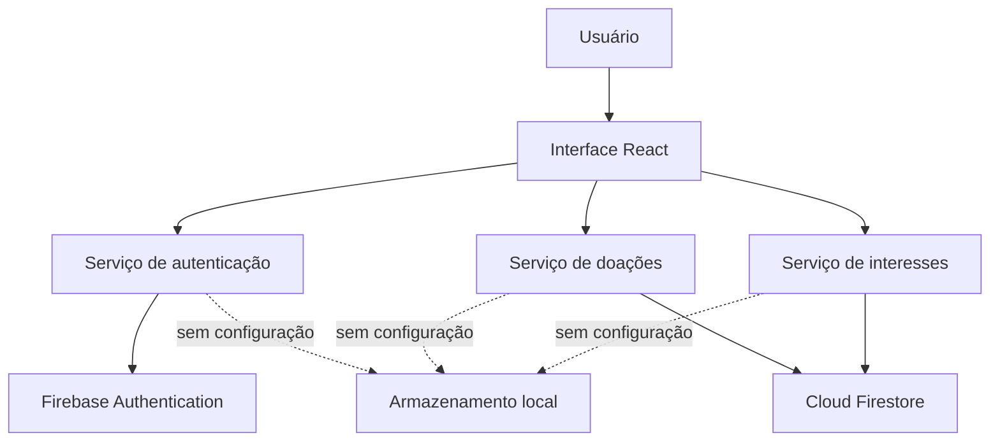

# Arquitetura

## Visão geral

O AjudaVizinho é uma aplicação web de página única. A interface React chama serviços isolados, que escolhem entre Firebase e armazenamento local conforme a presença das variáveis de ambiente.

## Componentes

| Componente | Responsabilidade |
|---|---|
| `src/App.jsx` | Interface, navegação, formulários e coordenação dos casos de uso |
| `authService.js` | Cadastro, sessão, login e logout |
| `donationService.js` | CRUD e mudança de estado das doações |
| `interestService.js` | Solicitações, duplicidade, aceite e recusa |
| `firebase.js` | Inicialização segura e seleção do banco `default` |
| `firestore.rules` | Autorização e proteção dos dados |

## Decisões

- Firebase foi adotado como Backend as a Service para manter o escopo viável.
- A camada de serviços separa regras de persistência da interface.
- O modo local torna a demonstração possível sem credenciais.
- Operações críticas verificam propriedade também nas regras do Firestore.
- O aceite usa gravação em lote para atualizar solicitação e reserva de forma atômica.
