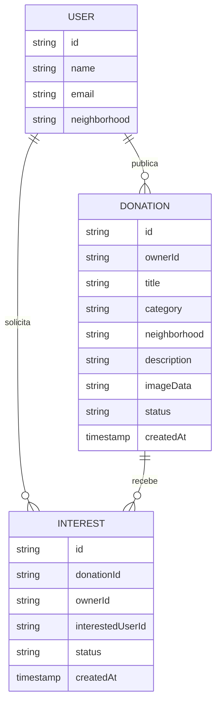

# Modelo de dados

## Entidades

## Coleções

### `users`

O identificador do documento é o UID do Firebase Authentication. Apenas o próprio usuário pode criar, ler ou atualizar o perfil.

### `donations`

Estados permitidos: `available`, `reserved` e `donated`. A leitura é pública; criação exige autenticação; edição e exclusão são exclusivas do proprietário. O campo opcional `imageData` contém uma imagem comprimida em Data URL, limitada pelas regras de segurança a 500.000 caracteres e pelo aplicativo a 360 KB de dados.

### `interests`

O identificador combina doação e usuário interessado, impedindo duplicidade. Estados: `pending`, `accepted` e `rejected`. Somente as duas partes envolvidas podem ler; apenas o doador decide.

## Regras de negócio

1. Um usuário não pode solicitar a própria doação.
2. Apenas itens disponíveis recebem novas solicitações.
3. Cada usuário possui no máximo uma solicitação por doação.
4. O aceite altera a doação para reservada.
5. Somente o proprietário pode editar, excluir ou concluir a doação.
6. Fotos são opcionais, aceitam JPG, PNG ou WebP e são reduzidas no navegador antes da persistência.
